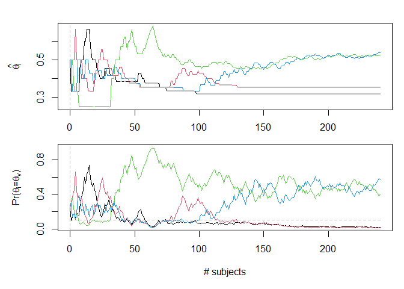

<!-- README.md is generated from README.Rmd. Please edit that file -->

# barts

<!-- badges: start -->
<!-- badges: end -->

barts is a companion package to Arjas & Gasbarra (2021). The package
implements a number of treatment allocation and selection rules for use
in clinical trials, and provides a mechanism to simulate trials to
evaluate operating characteristics. Currently, barts only supports
binary data with Beta-priors.

## Installation

barts is not (yet) available on CRAN. You can install the current
development version with:

``` r
# install.packages("remotes")
remotes::install_github("Orion-Corporation/barts")
```

## Example

Simulating a single study is done in two phases: first define the study
phases, then generate realisations with `simulate_study()`. A simple
plotting method is provided for a quick overview of the results of a
single realization.

``` r
library(barts)
set.seed(42)

study <- single_phase_study(n = 240, rule = rule_1(epsilon = 0.1))
result <- simulate_study(study, a = 1, b = 1, theta = 0.2 + 1:4 / 10)

plot(result)
```


